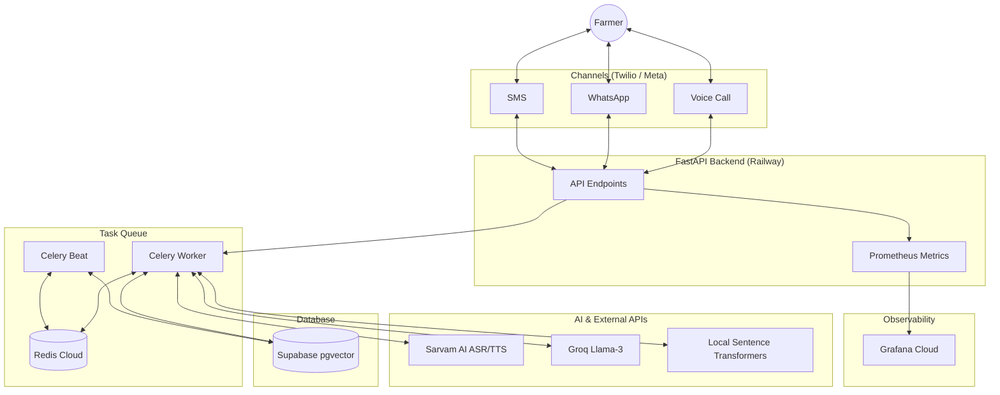

# Kisan Voice Bot

A production-grade multilingual agricultural AI assistant for Indian farmers.

## Live Demo
[Link to Live Demo Placeholder](https://kisanbot.up.railway.app)

## Architecture

## Setup Instructions

1. Clone the repository.
2. Install dependencies: `pip install -r requirements.txt`.
3. Create `.env` from `.env.example` and fill in credentials.
4. Run the FastAPI server: `uvicorn app.main:app --reload`.
5. Run the Celery worker: `celery -A app.worker.celery_app worker -l info`.

### Environment Variables

| Variable | Description | Default / Example |
| -------- | ----------- | ----------------- |
| `PROJECT_NAME` | Name of the project | `Kisan Voice Bot` |
| `REDIS_URL` | Redis connection URL | `redis://localhost:6379/0` |
| `TWILIO_ACCOUNT_SID` | Twilio SID | |
| `TWILIO_AUTH_TOKEN` | Twilio Token | |
| `TWILIO_PHONE_NUMBER` | Twilio Number | |
| `SARVAM_API_KEY` | Sarvam AI key | |
| `SUPABASE_URL` | Supabase Project URL | |
| `SUPABASE_KEY` | Supabase anon/service key | |
| `POSTGRES_URL` | Supabase pooler URL | `postgres://...pooler.supabase.com:6543/postgres` (Ensure `@` in password is `%40`) |
| `GROQ_API_KEY` | Groq API Key | |
| `GROQ_MODEL` | Groq Model Name | `llama-3.3-70b-versatile` |
| `WHATSAPP_TOKEN` | WhatsApp API Token | |
| `WHATSAPP_PHONE_NUMBER_ID`| WhatsApp Phone ID | |

## Deployment
This project is configured for free-tier deployment on Railway. Use the provided `railway.toml` and `Procfile`.
